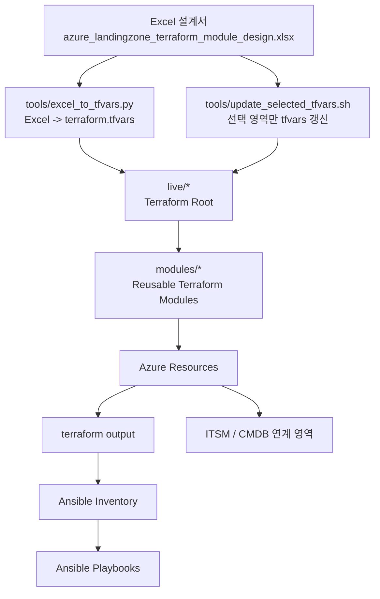

# Azure Landing Zone Terraform Lab

Excel 설계서를 기준으로 Azure Landing Zone, 네트워크, 워크로드, VM, AKS, Private Endpoint, 모니터링, Ansible 연계를 단계별로 배포하는 Terraform 예제 프로젝트입니다.

이 저장소는 학습 및 사전 검증용 템플릿입니다. 실제 운영 환경에 적용하기 전에는 보안 정책, 네트워크 주소, 권한 모델, 비용 정책, 삭제 방지 정책을 조직 기준에 맞게 검토해야 합니다.


## 목적

이 프로젝트의 목적은 엔터프라이즈 Azure Landing Zone을 Excel 기반 설계서로 관리하고, 설계값을 Terraform 변수로 변환하여 필요한 영역만 독립적으로 배포하는 구조를 검증하는 것입니다.

특히 다음 시나리오를 기준으로 테스트했습니다.

- 부서별 Landing Zone 분리
- Hub-Spoke 네트워크 구성
- 온프레미스 연동을 고려한 Private Network 구조
- 내부 DNS, Private DNS, Private Endpoint 중심 설계
- Public IP를 기본적으로 금지하는 폐쇄망형 구성
- VM, AKS, AI, Web/WAS/DB, Load Balancer 구성 확장
- Terraform 이후 Ansible 기반 OS/WAS/App 구성관리
- 테스트 환경에서 1시간 후 자동 destroy 예약
- 운영 환경에서는 실수 삭제를 방지하는 destroy guard 개념 반영

## 주요 기능

- Excel 설계값을 Terraform 변수 파일로 변환
- 전체 변환과 선택 영역 변환 분리
- Foundation, Platform, Workload, Service, Access 영역 분리
- 각 Terraform root별 독립 state 사용
- Hub-Spoke 네트워크 구조
- 내부 전용 VM, AKS, AI 서비스 구성 예제
- Application Gateway, Internal Load Balancer 구성 예제
- Private DNS, Private Endpoint, Firewall Rule 구성 예제
- Terraform output을 Ansible inventory로 변환
- 테스트 환경에서 1시간 후 자동 destroy 예약
- Git 업로드 전 민감정보 제외 기준 정리

## 전체 구성 개요



## 디렉터리 구조

```text
.
├── modules/                 # 재사용 Terraform 모듈
├── live/                    # 실제 배포 루트. 영역별 독립 state 사용
│   ├── 00-foundation/       # Resource Group 등 기본 자원
│   ├── 10-platform/         # Hub Network, Firewall 등 플랫폼 자원
│   ├── 20-workload/         # 부서/업무별 Spoke Landing Zone
│   ├── 30-services/         # VM, AKS, AI, LB, App Gateway 등 서비스 자원
│   └── 40-access/           # DNS, Private Endpoint, Firewall Rule
├── tools/                   # Excel 변환, Terraform 실행, destroy 예약 도구
├── ansible/                 # VM 구성관리 playbook
├── docs/                    # 설계 및 운영 가이드
├── pipelines/               # CI/CD 예제
└── backend.hcl.example      # Terraform backend 예제
```

## Terraform Root 구성

| 영역 | 예시 경로 | 역할 |
|---|---|---|
| Foundation | `live/00-foundation/resource-groups` | 기본 Resource Group 생성 |
| Platform | `live/10-platform/hub-network` | Hub VNet, 공통 네트워크 |
| Platform | `live/10-platform/azure-firewall` | Azure Firewall 구성 예제 |
| Workload | `live/20-workload/sales-dev-spoke` | 부서/업무별 Spoke VNet |
| Workload | `live/20-workload/api-dev-spoke` | AKS 테스트용 Spoke VNet |
| Service | `live/30-services/vm-sales-dev` | VM 생성 예제 |
| Service | `live/30-services/aks-api-dev` | AKS 생성 예제 |
| Service | `live/30-services/alb-sales-dev-web` | Application Gateway 예제 |
| Service | `live/30-services/nlb-sales-dev-web` | Internal Load Balancer 예제 |
| Service | `live/30-services/webwas-sales-dev` | Web/WAS Stack 예제 |
| Access | `live/40-access/private-dns-zones` | Private DNS Zone 예제 |
| Access | `live/40-access/private-endpoint` | Private Endpoint 예제 |
| Access | `live/40-access/firewall-rule` | Firewall Rule 예제 |
| Access | `live/40-access/dns-record` | DNS Record 예제 |

## 모듈 구성

| 모듈 | 역할 |
|---|---|
| `modules/resource_group` | Resource Group 생성 |
| `modules/network_hub` | Hub VNet, Subnet, Peering 기반 |
| `modules/workload_spoke` | Workload VNet, Subnet, NSG, Route Table |
| `modules/linux_vm` | Linux VM, NIC, OS Disk 구성 |
| `modules/web_was_stack` | Web/WAS/DB 유형의 VM Stack |
| `modules/aks_private` | AKS Cluster 구성 |
| `modules/ai_private` | Private AI 서비스 구성 |
| `modules/application_gateway` | Application Gateway 구성 |
| `modules/internal_load_balancer` | Internal Load Balancer 구성 |
| `modules/private_dns_zones` | Private DNS Zone 구성 |
| `modules/private_endpoint` | Private Endpoint 구성 |
| `modules/firewall_rule` | Firewall 정책/Rule 구성 |
| `modules/dns_record` | DNS Record 구성 |
| `modules/ansible_inventory` | Terraform output 기반 Ansible inventory 생성 |

## Git 업로드 주의사항

아래 파일은 실제 계정 정보, state, 로그, 키가 포함될 수 있으므로 Git에 올리면 안 됩니다.

```gitignore
.ssh/
.terraform/
.terraform.d/
*.tfstate
*.tfstate.*
*.tfplan
tfplan
crash.log
crash.*.log
terraform.tfvars
*.auto.tfvars
*.auto.tfvars.json
backend.hcl
generated_tfvars/
logs/
backups/
*.zip
*.tar.gz
*.xlsx
__pycache__/
*.pyc
ansible/inventories/generated/*.ini
```

공개 저장소에 올릴 때는 실제 값 대신 아래처럼 placeholder를 사용합니다.

```text
<TENANT_ID>
<SUBSCRIPTION_ID>
<RESOURCE_GROUP_NAME>
<STORAGE_ACCOUNT_NAME>
<USER_EMAIL>
<SSH_HOST>
<TFSTATE_RESOURCE_GROUP>
```

Git 업로드 전 수행한 정리 기준은 다음과 같습니다.

- SSH 개인키 제외
- `terraform.tfvars` 제외
- `backend.hcl` 제외
- `tfstate`, `tfplan`, `.terraform/` 제외
- 실행 로그와 destroy 예약 로그 제외
- Excel 설계서와 백업 압축 파일 제외
- 문서와 스크립트에 남아 있던 실제 구독 ID, tenant ID, 이메일, backend 저장소 이름 제거
- `backend.tf`는 실제 backend 값을 넣지 않고 `backend "azurerm" {}` 형태로 정리
- 실제 backend 값은 Git 제외 대상인 `backend.hcl`로 주입

## 사전 준비

Linux 서버에서 실행하는 것을 기준으로 합니다.

```bash
cd /home/son/azure_land06

terraform version
az version
python3 --version
```

Azure 로그인 상태를 확인합니다.

```bash
az account show -o table
```

필요 시 구독을 선택합니다.

```bash
az account set --subscription <SUBSCRIPTION_ID>
```

Terraform backend 예제 파일을 복사한 뒤 실제 환경값을 입력합니다.

```bash
cp backend.hcl.example backend.hcl
vi backend.hcl
```

예시:

```hcl
resource_group_name  = "<TFSTATE_RESOURCE_GROUP>"
storage_account_name = "<STORAGE_ACCOUNT_NAME>"
container_name       = "tfstate"
key                  = "<STATE_KEY>"
use_azuread_auth     = true
```

이 프로젝트의 `tools/tf_root.sh`는 각 Terraform root를 실행할 때 `backend.hcl`과 root별 state key를 backend config로 전달하는 구조입니다.

## Excel 기반 tfvars 생성

전체 Excel 설계값을 기준으로 tfvars를 생성합니다.

```bash
python3 tools/excel_to_tfvars.py \
  --excel azure_landingzone_terraform_module_design.xlsx \
  --out live \
  --tenant-id <TENANT_ID> \
  --subscription-id <SUBSCRIPTION_ID>
```

이 명령은 Excel의 설계값을 읽어서 `live/**/terraform.tfvars` 파일을 생성하거나 갱신합니다. 실제 `terraform.tfvars`는 Git 제외 대상입니다.

## 선택 영역만 tfvars 갱신

운영 중에는 전체 Excel을 매번 변환하지 않고 변경된 영역만 반영할 수 있도록 선택 갱신 스크립트를 사용합니다.

```bash
tools/update_selected_tfvars.sh --target azure-firewall \
  --tenant-id <TENANT_ID> \
  --subscription-id <SUBSCRIPTION_ID>
```

환경 변수로도 전달할 수 있습니다.

```bash
export TENANT_ID=<TENANT_ID>
export SUBSCRIPTION_ID=<SUBSCRIPTION_ID>

tools/update_selected_tfvars.sh --target azure-firewall
```

예시:

```bash
tools/update_selected_tfvars.sh --target workload --department Sales --environment dev
tools/update_selected_tfvars.sh --target vm --workload sales --environment dev
tools/update_selected_tfvars.sh --target aks --workload api --environment dev
tools/update_selected_tfvars.sh --target nlb --workload sales --environment dev
tools/update_selected_tfvars.sh --target alb --workload sales --environment dev
tools/update_selected_tfvars.sh --target private-dns-zones
```

## Terraform 실행 방식

직접 `terraform init`, `terraform plan`, `terraform apply`를 실행할 수도 있지만, 이 프로젝트에서는 `tools/tf_root.sh` 사용을 기준으로 합니다.

```bash
tools/tf_root.sh <TERRAFORM_ROOT> <plan|apply|destroy|validate>
```

예시:

```bash
tools/tf_root.sh live/20-workload/api-dev-spoke plan
tools/tf_root.sh live/20-workload/api-dev-spoke apply
```

이 스크립트는 다음 역할을 합니다.

- 지정한 Terraform root로 이동
- backend 설정 주입
- root별 state key 사용
- plan/apply/destroy 표준화
- apply 성공 시 테스트 환경 자동 destroy 예약 연계

## 전체 배포 순서

처음부터 배포할 때는 아래 순서로 진행합니다.

```bash
# 1. Foundation
tools/tf_root.sh live/00-foundation/resource-groups plan
tools/tf_root.sh live/00-foundation/resource-groups apply

# 2. Hub Network
tools/tf_root.sh live/10-platform/hub-network plan
tools/tf_root.sh live/10-platform/hub-network apply

# 3. Workload Spoke
tools/tf_root.sh live/20-workload/api-dev-spoke plan
tools/tf_root.sh live/20-workload/api-dev-spoke apply

# 4. Service: AKS
tools/tf_root.sh live/30-services/aks-api-dev plan
tools/tf_root.sh live/30-services/aks-api-dev apply

# 5. Service: VM
tools/tf_root.sh live/30-services/vm-sales-dev plan
tools/tf_root.sh live/30-services/vm-sales-dev apply

# 6. Access: DNS / Private Endpoint / Firewall Rule
tools/tf_root.sh live/40-access/private-dns-zones plan
tools/tf_root.sh live/40-access/private-dns-zones apply
```

## Foundation 테스트 결과

Foundation 영역은 Resource Group 같은 기본 자원을 만드는 영역입니다.

테스트 중 Foundation 배포가 성공했는데 Azure Portal에서 큰 자원이 보이지 않아 혼동이 있었습니다. 이 경우는 정상입니다. Foundation root가 VM, AKS, Firewall 같은 비용성 자원을 만드는 것이 아니라 기본 Resource Group을 만드는 단계이기 때문입니다.

확인 명령:

```bash
az group list -o table
```

특정 Resource Group 확인:

```bash
az group show -n <RESOURCE_GROUP_NAME> -o table
```

## VM 테스트 결과와 오류 해결

VM 테스트에서는 Subnet 이름과 Static IP 대역 불일치 문제가 있었습니다.

### 오류 1: Subnet not found

오류 예:

```text
Subnet Name: "snet-devops-agent" was not found
```

원인:

- VM tfvars에서 참조한 subnet 이름이 실제 Workload Spoke에 생성된 subnet 이름과 달랐습니다.

해결:

- `snet-devops-agent` 참조를 실제 subnet 이름인 `snet-agent`로 수정했습니다.

### 오류 2: PrivateIPAddressNotInSubnet

오류 예:

```text
Private static IP address 10.40.2.12 does not belong to the range of subnet prefix 10.40.1.0/24.
```

원인:

- VM별 고정 IP와 subnet CIDR이 맞지 않았습니다.

수정 기준:

| VM | Subnet | IP 예시 |
|---|---|---|
| web01 | `snet-web` | `10.x.0.11` |
| was01 | `snet-was` | `10.x.1.11` |
| was02 | `snet-was` | `10.x.1.12` |
| db01 | `snet-db` | `10.x.2.11` |
| agent01 | `snet-agent` | `10.x.5.11` |

## AKS 테스트 결과와 오류 해결

AKS 테스트를 위해 `live/30-services/aks-api-dev` Terraform root를 구성했습니다.

### 오류 1: No configuration files

오류:

```text
Error: No configuration files
```

원인:

- `live/30-services/aks-api-dev` 디렉터리에 Terraform `.tf` 파일이 없었습니다.

해결:

- 다음 파일을 추가했습니다.

```text
live/30-services/aks-api-dev/backend.tf
live/30-services/aks-api-dev/main.tf
live/30-services/aks-api-dev/outputs.tf
live/30-services/aks-api-dev/variables.tf
live/30-services/aks-api-dev/versions.tf
```

### 오류 2: disableLocalAccounts와 Entra ID 연동

오류:

```text
Since kubernetes version 1.25, disableLocalAccounts can only be set on Azure AD integration enabled cluster.
```

원인:

- Kubernetes 1.25 이상에서 `disableLocalAccounts`를 사용하려면 AKS에 Entra ID 연동이 필요합니다.

학습용 조치:

- Entra ID 연동을 아직 구성하지 않은 상태에서는 `local_account_disabled = false`로 테스트했습니다.

운영 기준:

- 운영 AKS는 Entra ID 연동을 활성화하고 local account를 비활성화하는 방향이 적절합니다.

### 오류 3: AKS Node Outbound Connectivity 실패

오류:

```text
VMExtensionProvisioningError
VMExtensionError_OutboundConnFail
AKS Node provisioning failed due to inability to establish outbound connectivity to obtain packages.
```

원인:

- AKS subnet에 연결된 route table에서 `0.0.0.0/0`이 Azure Firewall 또는 NVA 방향으로 강제 라우팅되고 있었습니다.
- 테스트 환경의 Firewall/NVA egress 허용 정책이 충분하지 않아 AKS node provisioning 중 필요한 패키지를 가져오지 못했습니다.

학습용 조치:

- `api-dev-spoke`의 `snet-aks`에서 route table 연결을 해제했습니다.
- AKS subnet의 `routeTable`이 `null`인지 확인했습니다.

확인 명령:

```bash
az network vnet subnet show \
  -g <RESOURCE_GROUP_NAME> \
  --vnet-name <VNET_NAME> \
  -n snet-aks \
  --query routeTable \
  -o json
```

운영 기준:

- 운영에서는 단순히 route table을 제거하지 말고, AKS outbound requirements에 맞게 Firewall FQDN/Application Rule, NAT, UDR 정책을 설계해야 합니다.
- Private AKS, Azure CNI, NAT Gateway, Azure Firewall egress 제어 중 어떤 모델을 쓸지 명확히 정해야 합니다.

## AKS 테스트용 Spoke 구성

AKS 테스트를 위해 API 개발용 Spoke를 추가했습니다.

예시 구조:

| 항목 | 예시 |
|---|---|
| Resource Group | `<API_DEV_RESOURCE_GROUP>` |
| VNet | `<API_DEV_VNET>` |
| VNet CIDR | `10.x.0.0/20` |
| Web Subnet | `10.x.0.0/24` |
| WAS Subnet | `10.x.1.0/24` |
| DB Subnet | `10.x.2.0/24` |
| AKS Subnet | `10.x.3.0/24` |
| Private Endpoint Subnet | `10.x.4.0/24` |
| Agent Subnet | `10.x.5.0/24` |
| App Gateway Subnet | `10.x.6.0/24` |

## Azure Quota 확인

테스트 중 vCPU quota가 부족해 VM/AKS 배포에 영향이 있었습니다.

전체 regional vCPU 확인:

```bash
az vm list-usage -l koreacentral \
  --query "[?localName=='Total Regional vCPUs'].{Name:localName,Used:currentValue,Limit:limit}" \
  -o table
```

VM family별 quota 확인:

```bash
az vm list-usage -l koreacentral \
  --query "[?contains(localName, 'DSv3') || contains(localName, 'DSv4') || contains(localName, 'BS')].{Name:localName,Used:currentValue,Limit:limit}" \
  -o table
```

테스트 기준:

- quota가 작으면 VM 수량을 줄입니다.
- AKS node count를 1로 낮춥니다.
- VM SKU를 quota가 있는 family로 변경합니다.
- 사용하지 않는 Resource Group을 삭제해 quota를 확보합니다.

## 전체 자원 확인 명령

전체 Resource Group:

```bash
az group list -o table
```

전체 Azure 자원:

```bash
az resource list -o table
```

특정 Resource Group 자원:

```bash
az resource list -g <RESOURCE_GROUP_NAME> -o table
```

AKS:

```bash
az aks list -o table
```

VM:

```bash
az vm list -o table
```

NIC:

```bash
az network nic list -o table
```

VNet:

```bash
az network vnet list -o table
```

Subnet:

```bash
az network vnet subnet list \
  -g <RESOURCE_GROUP_NAME> \
  --vnet-name <VNET_NAME> \
  -o table
```

## 삭제 방법

개별 root 삭제:

```bash
tools/tf_root.sh live/30-services/aks-api-dev destroy
tools/tf_root.sh live/20-workload/api-dev-spoke destroy
```

Resource Group 직접 삭제:

```bash
az group delete -n <RESOURCE_GROUP_NAME> --yes --no-wait
```

AKS 생성 실패 후 남은 리소스 정리:

```bash
az aks delete -g <RESOURCE_GROUP_NAME> -n <AKS_NAME> --yes
az group delete -n <AKS_NODE_RESOURCE_GROUP> --yes
```

## 1시간 자동 destroy

테스트 환경에서는 비용 방지를 위해 1시간 후 자동 destroy를 예약할 수 있습니다.

```bash
tools/schedule_destroy_all.sh 3600
```

또는 Terraform apply 성공 후 `tools/tf_root.sh`에서 자동 destroy 예약을 연계할 수 있습니다.

주의:

- 이 기능은 학습/테스트 환경 전용입니다.
- 운영 환경에서는 사용하면 안 됩니다.
- 운영 환경은 승인 절차, 리소스 잠금, destroy guard를 적용해야 합니다.

## 운영 환경 destroy 보호

운영 환경에서는 실수로 `destroy`가 실행되지 않도록 다음 정책을 적용해야 합니다.

- `env=prod` 대상 destroy 차단
- 별도 승인 없이는 destroy 불가
- Resource Lock 사용 검토
- 중요 리소스는 `prevent_destroy` 사용 검토
- Pipeline에서 plan 결과 승인 후 apply
- break-glass 계정 별도 관리

현재 테스트 구성에서는 학습 편의를 위해 삭제 방지 기능을 최소화했습니다. 운영에 적용할 때는 반드시 다시 활성화해야 합니다.

## 비용이 큰 자원

테스트 과정에서 비용 영향이 큰 자원은 다음 순서로 관리해야 합니다.

| 자원 | 비용 영향 |
|---|---|
| Azure Firewall | 시간당 비용과 데이터 처리 비용이 큼 |
| ExpressRoute Gateway | 시간당 비용이 큼 |
| AKS Node Pool | 실제 VM node 비용 발생 |
| VM | SKU와 실행 시간에 따라 비용 발생 |
| Application Gateway | SKU와 실행 시간에 따라 비용 발생 |
| Private Endpoint | 개수와 트래픽 기준 비용 |
| Azure OpenAI / AI Search | SKU, 사용량, 인덱스 크기 기준 비용 |
| Log Analytics | 수집량과 보존 기간 기준 비용 |

학습 환경에서는 비용성 자원을 만들기 전 반드시 `plan`을 확인하고, 테스트 후 destroy를 수행합니다.

## 모니터링 설계

모니터링 영역은 다음 구성을 기준으로 설계했습니다.

- Log Analytics Workspace
- Azure Monitor Metrics
- Diagnostic Settings
- Activity Log 수집
- VM 성능 지표
- AKS Container Insights
- Application Gateway 지표
- Load Balancer 지표
- Private Endpoint 연결 상태
- Firewall 로그
- 임계치 기반 Alert Rule
- Action Group 기반 Email/SMS/Webhook 알림
- Dashboard / Workbook 기반 기본 관제 화면

SMS 발송은 Azure Monitor Action Group에서 SMS receiver를 구성하는 방식입니다. 실제 운영에서는 SMS 수신자, 알림 시간, 장애 등급, 중복 알림 억제 정책을 별도로 정해야 합니다.

## 운영 중 변경 절차

운영 중 추가 요청이 들어오면 전체를 다시 배포하지 않고 변경 영역만 반영합니다.

1. Excel 설계서에서 변경 요청 항목을 수정합니다.
2. `tools/update_selected_tfvars.sh`로 변경 대상 tfvars만 갱신합니다.
3. 해당 Terraform root에서만 `plan`을 수행합니다.
4. 생성, 변경, 삭제 대상을 검토합니다.
5. 승인 후 해당 root만 `apply`합니다.
6. VM 내부 설정이 필요하면 Ansible inventory를 갱신합니다.
7. Ansible playbook을 실행합니다.
8. CMDB, 운영 문서, 비용 태그를 갱신합니다.

예시:

```bash
export TENANT_ID=<TENANT_ID>
export SUBSCRIPTION_ID=<SUBSCRIPTION_ID>

tools/update_selected_tfvars.sh --target vm --workload sales --environment dev
tools/tf_root.sh live/30-services/vm-sales-dev plan
tools/tf_root.sh live/30-services/vm-sales-dev apply
```

## Ansible 연계

Terraform으로 VM을 만든 뒤 Terraform output을 Ansible inventory로 변환할 수 있습니다.

```bash
terraform output -json > tf_output.json

python3 tools/tf_output_to_ansible_inventory.py \
  --input tf_output.json \
  --out ansible/inventories/generated/sales-dev.ini
```

Playbook 실행 예:

```bash
ansible-playbook -i ansible/inventories/generated/sales-dev.ini ansible/playbooks/linux_base.yml
ansible-playbook -i ansible/inventories/generated/sales-dev.ini ansible/playbooks/tomcat_install.yml
ansible-playbook -i ansible/inventories/generated/sales-dev.ini ansible/playbooks/app_deploy.yml
```

## CI/CD 예제

`pipelines/` 디렉터리에 GitHub Actions와 Azure DevOps 예제가 있습니다.

```text
pipelines/github/terraform-ansible.yml
pipelines/azuredevops/terraform-ansible.yml
```

운영 Pipeline에서는 다음 통제가 필요합니다.

- PR 기반 변경 검토
- Terraform fmt/validate
- Terraform plan artifact 저장
- 보안 스캔
- 비용 추정
- 승인 후 apply
- prod destroy 차단
- 민감 변수는 GitHub Secret 또는 Azure DevOps Variable Group 사용

## 보안 원칙

- Public IP는 기본 금지합니다.
- VM, AKS, AI, Storage, Key Vault는 Private Network 접근을 우선합니다.
- 운영 계정은 최소 권한과 PIM 승인을 기준으로 합니다.
- Terraform state와 tfvars는 Git에 저장하지 않습니다.
- SSH 개인키, kubeconfig, access token, backend 설정은 저장소에 포함하지 않습니다.
- 테스트 환경은 TTL destroy를 사용하고, 운영 환경은 승인 없는 destroy를 차단합니다.
- Entra ID, Conditional Access, PIM, Private Access, DNS, Firewall 정책을 함께 설계해야 합니다.

## 현재까지 반영한 추가 항목

- Application Gateway 구성 영역
- Internal Load Balancer 구성 영역
- Private Endpoint 구성 영역
- Private DNS 구성 영역
- Firewall Rule 구성 영역
- AKS 구성 영역
- VM 구성 영역
- Web/WAS/DB Stack 구성 영역
- AI Private 구성 영역
- 모니터링, 알람, 대시보드 설계
- 1시간 TTL destroy 예약
- Git 공개 업로드용 민감정보 제외
- backend 값 분리
- 선택적 tfvars 갱신 스크립트

## 참고 문서

상세 설계와 운영 절차는 `docs/` 디렉터리를 참고합니다.

- `docs/IMPLEMENTATION_GUIDE.md`
- `docs/DEPLOYMENT_RUNBOOK.md`
- `docs/TFVARS_MAPPING.md`
- `docs/TERRAFORM_TTL_DESTROY.md`
- `docs/MONITORING_DESIGN.md`
- `docs/AZURE_RESOURCE_LIST.md`
- `docs/EXCEL_MAPPING.md`
- `docs/LATEST_LZ_TRENDS_APPLIED.md`
